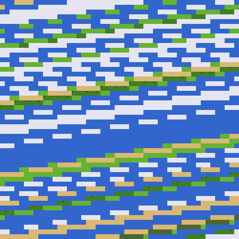
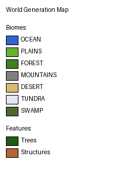

# World Generation System - Medieval Edition

## Overview

The enhanced world generation system creates diverse, biome-rich medieval worlds with procedural textures, ore veins, trees, and structure spawn points for medieval buildings.


*Example world map showing biomes, trees, and structure spawn points*



## Features

### Biome System

Six distinct biomes generated using temperature and moisture noise:

1. **Plains** - Rolling grasslands, good for building
2. **Forest** - Dense tree coverage, wood resources
3. **Mountains** - High elevation rocky terrain
4. **Desert** - Sandy dunes, hot and dry
5. **Tundra** - Snowy wastelands, cold climate
6. **Swamp** - Clay-rich wetlands

Biomes are determined by:
- Temperature gradient (cold to hot)
- Moisture levels (dry to wet)
- Altitude (affects temperature)

### Ore Generation

Six ore types spawn at specific depth ranges:

| Ore | Depth Range | Rarity | Color |
|-----|-------------|--------|-------|
| Coal | Y -50 to 50 | Common | Black |
| Copper | Y -80 to 20 | Common | Orange-Brown |
| Tin | Y -60 to 40 | Common | Light Gray |
| Iron | Y -100 to 0 | Uncommon | Gray-Brown |
| Silver | Y -150 to -30 | Rare | Silver |
| Gold | Y -200 to -50 | Very Rare | Gold |

Ores generate as veins using 3D cellular noise patterns.

### Tree Generation

Trees spawn procedurally in Forest and Plains biomes:
- **Forest**: 30% tree density
- **Plains**: 5% tree density
- Trees consist of wood trunk (5-7 blocks) and leaf crown
- Positioned on grass surface blocks

### Structure Generation

Medieval structure spawn points are marked in the world:
- **Village Houses**: Common in plains
- **Watchtowers**: Forests and plains
- **Forges**: For metalworking
- **Mine Entrances**: Mountains
- **Castle Ruins**: Desert and mountains
- **Stone Circles**: Tundra and forests

Structure generation uses cellular noise for rare spawn points (~0.1% of chunks).

## New Block Types

### Building Materials
- **Cobblestone**: Medieval stone construction
- **Wood Planks**: Processed wood for buildings
- **Thatch**: Roof material
- **Bricks**: Fired clay blocks
- **Stone Bricks**: Refined stone

### Environment
- **Snow**: Surface in tundra biomes
- **Ice**: Frozen water
- **Gravel**: Rocky ground material

## Procedural Textures

All textures are generated procedurally at 16x16 pixels for a retro medieval aesthetic:

### Terrain Textures
- Grass, Dirt, Stone, Sand
- Snow, Ice, Gravel
- Wood, Leaves
- Cobblestone, Wood Planks, Thatch, Bricks
- All ore variants (Coal, Iron, Copper, Tin, Gold, Silver)

### Item Icons
- Weapons: Sword, Axe, Mace
- Tools: Pickaxe, Hammer, Shovel
- Armor: Helmet, Chestplate, Shield

## Usage

### Generating Textures

Textures are automatically generated on first run. To manually regenerate:

1. **In Game**: Press F9 to regenerate textures
2. **In Editor**: Run `scripts/utils/texture_gen_tool.gd` from File -> Run

### World Configuration

Adjust world generation in the WorldGenerator node:

```gdscript
@export var world_seed: int = 12345          # Seed for deterministic generation
@export var render_distance: int = 8         # Horizontal chunk render distance
@export var vertical_render_distance: int = 8 # Vertical chunk render distance
@export var continent_scale: float = 0.005   # Large-scale landmass size
@export var terrain_scale: float = 0.02      # Detail level of terrain
```

### Biome Configuration

Biomes are determined by noise values in `BiomeGenerator`:
- Temperature noise controls hot/cold regions
- Moisture noise controls wet/dry regions
- Altitude modifies temperature (higher = colder)

## Technical Details

### File Structure

```
scripts/systems/world_generation/
├── world_generator.gd      # Main world generation coordinator
├── biome_generator.gd      # Biome determination system
├── tree_generator.gd       # Procedural tree placement
└── structure_generator.gd  # Structure spawn point system

scripts/utils/
├── texture_generator.gd    # Procedural texture creation
└── texture_gen_tool.gd     # Editor tool for texture generation

scripts/autoload/
└── texture_loader.gd       # Runtime texture generation manager
```

### Generation Pipeline

1. **Chunk Request**: Player movement triggers chunk generation
2. **Terrain Height**: Continental and terrain noise determine elevation
3. **Rivers**: Flow downhill from high points to ocean
4. **Biome**: Temperature/moisture/altitude determine biome type
5. **Voxel Types**: Surface blocks based on biome, underground ores in veins
6. **Trees**: Placed on surface in forest/plains biomes
7. **Structures**: Rare spawn points marked for future building placement
8. **Mesh Generation**: Visible faces compiled into chunk mesh

### Performance Considerations

- Chunks are generated once and cached
- Tree placement checks every 4 blocks for performance
- Ore generation uses 3D noise for efficient vein patterns
- Textures generated once and reused for all voxels

## Future Enhancements

- [ ] Cave systems using 3D noise caverns
- [ ] Actual structure building (currently only spawn points)
- [ ] Texture atlas system for GPU-efficient rendering
- [ ] UV-mapped voxel faces for detailed textures
- [ ] Biome transitions and blending
- [ ] Villages with multiple connected buildings
- [ ] Dungeon generation in mountains
- [ ] Underwater ruins in ocean biome

## Credits

Procedural generation inspired by Minecraft and Vintage Story, adapted for Godot 4.x with a medieval theme.
